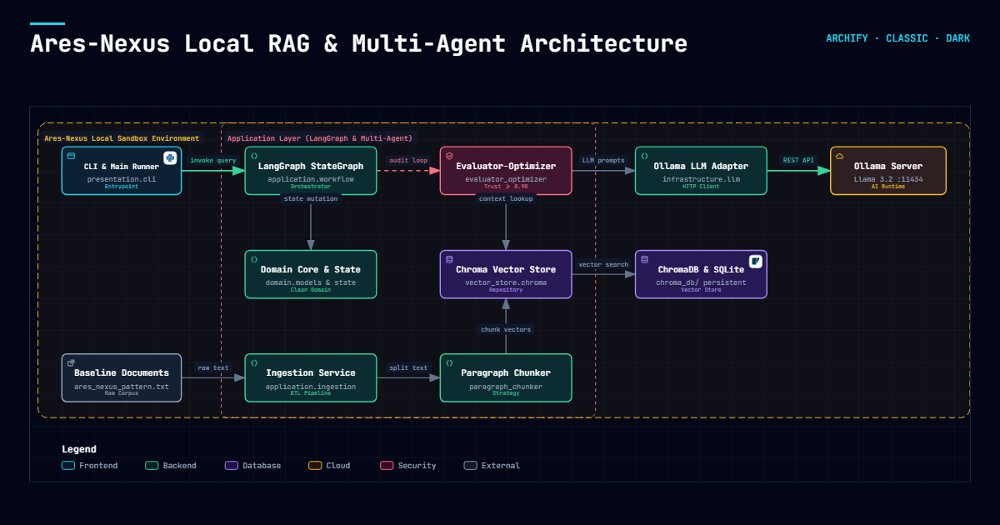

# Ares-Nexus: Local GenAI Sandbox

<!-- Architectural Badges -->


## Executive Summary
This repository serves as a production-grade local **Retrieval-Augmented Generation (RAG)** sandbox designed to evaluate the deployment and behavioral constraints of the **Ares-Nexus** architectural pattern within highly regulated environments.

The codebase strictly enforces **SOLID principles**, **Clean Architecture**, and the **Evaluator-Optimizer** Multi-Agent design pattern orchestrated natively via **LangGraph StateGraph**, establishing a closed-loop iterative audit mechanism to guarantee context grounding and verifiable inference.



[🔗 Abrir diagrama interactivo de arquitectura en el navegador](docs/architecture/architecture.html)

### Technical Flow Narrative
* **Presentation Layer (`src/presentation/cli.py` / `src/cli.py`):** Acts as the unified user interface and composition root, capturing CLI queries and bootstrapping dependencies to dispatch execution directly into the state graph.
* **Orchestrator Workflow (`src/application/workflow.py` - `LangGraphRAGWorkflow`):** Defines the directed cyclic state machine that coordinates state transitions across retrieval, drafting, evaluation, and conditional routing nodes while tracking multi-hop audit history.
* **Multi-Agent Verification Loop (`src/application/evaluator_optimizer.py` - `EvaluatorOptimizerController`):** Enforces closed-loop quality gating with an Optimizer agent drafting answers and an Evaluator judge auditing factual consistency claim-by-claim (target threshold $\ge 0.90$) with stagnation circuit breakers and defensive JSON parsing.
* **Vector Store & Persistence (`src/infrastructure/vector_store/` - ChromaDB & SQLite):** Manages localized persistence, semantic embedding storage via Ollama `nomic-embed-text`, and cosine similarity nearest-neighbor retrieval for contextual grounding chunks.

---

## Clean Architecture & Enterprise Design Patterns

```text
src/
├── domain/                      # Domain Layer (Entities, Value Objects, Interfaces & State)
│   ├── models.py                # DocumentChunk, RetrievedContextChunk, EvaluationResult, InferenceResponse
│   ├── interfaces.py            # VectorStoreRepository, LLMClient, EmbeddingGenerator, ChunkerStrategy
│   └── state.py                 # AgentState (Native LangGraph TypedDict Schema)
├── infrastructure/              # Infrastructure Layer (Concrete Adapters & DB Engines)
│   ├── chunking/                # ParagraphChunkerStrategy (Strategy Pattern)
│   ├── vector_store/            # ChromaVectorStoreRepository & VectorStoreFactory (Factory Pattern)
│   └── llm/                     # OllamaLLMClient, OllamaEmbeddingGenerator & LLMClientFactory
├── application/                 # Application Layer (Use Cases & Workflow Orchestrators)
│   ├── ingestion_service.py     # IngestionService (Single Responsibility orchestration)
│   ├── inference_service.py     # InferenceService (Dependency Inversion consumer)
│   ├── evaluator_optimizer.py   # EvaluatorOptimizerController (Closed-loop multi-agent audit)
│   └── workflow.py              # LangGraphRAGWorkflow (Native StateGraph orchestration)
├── presentation/                # Presentation Layer (CLI entrypoints & interactive loop)
│   └── cli.py                   # Native LangGraph .invoke() runner & composition root
├── config.py                    # Hyperparameters, settings, and system prompt templates
├── cli.py                       # CLI re-export adapter (backward compatibility)
└── main.py                      # Application bootstrap entrypoint
```

### 1. SOLID Principles Implementation
* **Single Responsibility Principle (SRP):** Distinct classes for persistence (`ChromaVectorStoreRepository`), LLM generation (`OllamaLLMClient`), embeddings (`OllamaEmbeddingGenerator`), chunking (`ParagraphChunkerStrategy`), graph topology (`LangGraphRAGWorkflow`), ingestion orchestration (`IngestionService`), and inference orchestration (`InferenceService`).
* **Open/Closed Principle (OCP) & Interface Segregation:** Abstract base classes (`VectorStoreRepository`, `LLMClient`, `EmbeddingGenerator`, `ChunkerStrategy`) defined in `src/domain/interfaces.py`. New backends (e.g., Amazon Bedrock, OpenSearch) can be plugged in without changing core business logic.
* **Dependency Inversion Principle (DIP):** High-level services (`LangGraphRAGWorkflow`, `InferenceService`, `IngestionService`, `EvaluatorOptimizerController`) depend strictly on domain interfaces via constructor injection (`__init__`).

### 2. Applied Design Patterns & Frameworks
* **LangGraph StateGraph Workflow:** Native directed cyclic state graph managing multi-agent state preservation, node execution, and conditional routing.
* **Evaluator-Optimizer Multi-Agent Pattern:** Two-agent loop with Optimizer (draft generator) and Evaluator (verification judge), claim-by-claim context auditing, and trust threshold gating.
* **Strategy Pattern:** Semantic text chunking encapsulated in `ParagraphChunkerStrategy` adhering to `ChunkerStrategy`.
* **Factory Pattern:** Extensible factories `VectorStoreFactory`, `LLMClientFactory`, and `EmbeddingGeneratorFactory`.

### 3. Defense-in-Depth Engineering Framework
* **Robust JSON Fault-Tolerance:** Transition from brittle text parsing to defensive regex-based extraction combined with try-except programmatic schema fallbacks.
* **Accumulative State Memory:** Progression from flat state overwrites to persistent state tracking vectors, enabling contrastive prompt context loops for the Optimizer.
* **Hardware-Frugality Circuit Breakers:** Algorithmic routing in conditional edges that enforces early exits if model optimization stalls below a 0.05 score variance delta.

---

## Native LangGraph Orchestration Lifecycle

```text
                  ┌─────────────────────────────────────────────────────────┐
                  │                 LangGraph StateGraph Engine             │
                  │                                                         │
[START] ─────────►│  [node_retrieve]                                        │
                  │        │                                                │
                  │        ▼                                                │
                  │  [node_optimize] ◄────────────────────────────────┐     │
                  │        │                                          │     │
                  │        ▼                                          │     │
                  │  [node_evaluate]                                  │     │
                  │        │                                          │     │
                  │        ▼                                          │     │
                  │  [should_continue] ──(score < 0.90 & retries < 3)─┘     │
                  │        │                                                │
                  │        │ (score >= 0.90 or retries >= 3)                │
                  │        ▼                                                │
                  │      [END]                                              │
                  └────────┼────────────────────────────────────────────────┘
                           │
                           ▼
                  [Verified Response / Safety Fallback]
```

### Agent State Schema (`AgentState`)
The central state dictionary preserves execution context across graph iterations:
* `query`: Original user prompt string.
* `retrieved_context`: List of semantic context chunks from `VectorStoreRepository`.
* `current_draft`: Current generated response from the Optimizer agent.
* `evaluation_score`: Continuous metric (0.0 to 1.0) produced by the Evaluator judge.
* `evaluation_feedback`: Detailed grounding and citation critique from the Evaluator.
* `retry_count`: Total revision cycles executed.
* `verified`: Boolean threshold acceptance flag (`score >= 0.90`).
* `final_answer`: Verified output string or deterministic safety fallback.
* `history`: Audit log tracking every iteration, draft, score, and critique.

---

## Core SLA & Operational Matrix

| Dimension | Sandbox Target (Local) | Enterprise Production Mapping (AWS) | Verification Method |
| :--- | :--- | :--- | :--- |
| **Orchestration** | Native LangGraph StateGraph | **Amazon Bedrock Agents / Step Functions** | Unit & Graph E2E Traces |
| **Data Vectorization**| Ollama `nomic-embed-text` | **Amazon Titan Embeddings v2** | Vector pipeline execution |
| **Vector Storage** | Local ChromaDB Partition | **Amazon OpenSearch Serverless / Aurora** | Cosine Similarity (< 0.85) |
| **Security & Guardrails** | Evaluator-Optimizer Dynamic Loop with a 0.90 Trust Threshold | **Amazon Bedrock Guardrails** | Automated regex validation, structured JSON evaluation fallback thresholds, and runtime execution stagnation checks |
| **Hallucination Rate**| 0.0% (Deterministic Fallback) | 0.0% via Guardrail Interception | RAGAS Framework Testing |

---

## Getting Started (Local Setup)

### Prerequisites
Ensure you have **Ollama** installed locally and the corresponding models downloaded:
```bash
ollama pull llama3.2
ollama pull nomic-embed-text
```

### Installation
1. Initialize virtual environment and install dependencies:
```bash
python -m venv venv
.\venv\Scripts\activate  # On Linux/macOS: source venv/bin/activate
pip install -r requirements.txt
```

2. Execute automated test suite (all 15 unit and graph tests):
```bash
python -m unittest discover tests
```

3. Run ingestion and single-turn query via LangGraph:
```bash
python main.py --ingest --reset
python main.py --query "How do Decision Gates act as security proxies in Ares-Nexus?"
```
